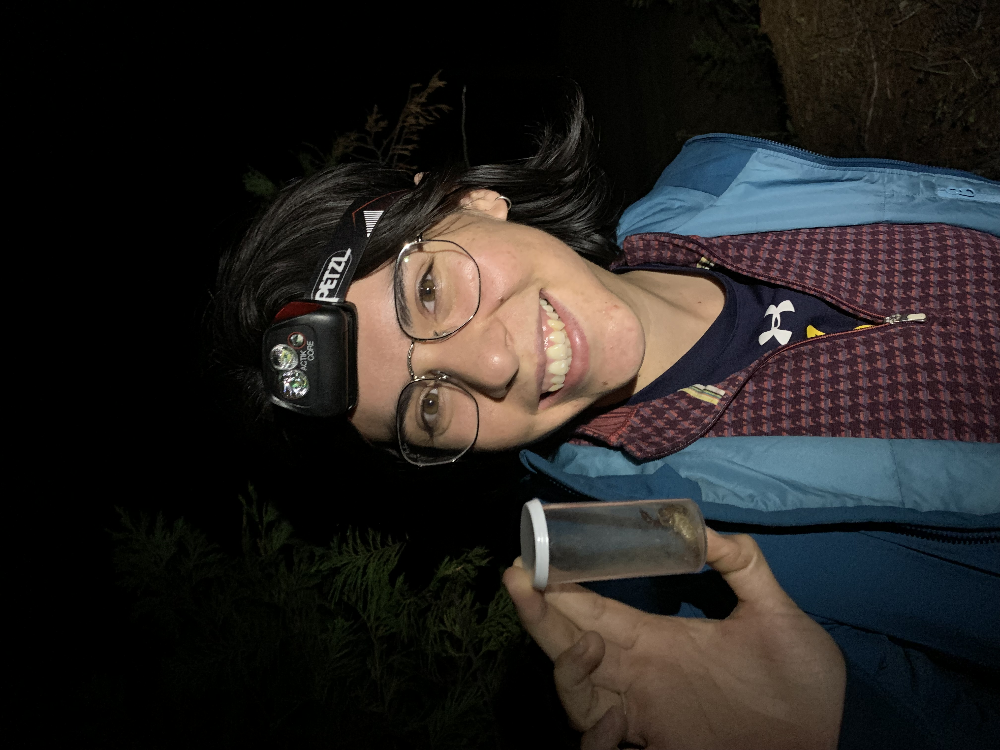

I am a graduate student researcher in the arachnology lab at the California Academy of Sciences. I am advised by Dr. Lauren Esposito and am working toward my master's degree in integrative biology at San Francisco State University. My research utilizes molecular data to revise the evolutionary relationships between genera in a group of small brown spiders called the marronoids. I also recently worked on a project called the Untold Stories from the Archives in which my team and I used the Academy archives to illuminate the stories of marginalized scientists throughout the history of the Academy. I grew up in Folsom, CA and attended UC Berkeley for my undergraduate degree in biology and anthropology. I considers herself a lifelong learner and want to do all I can to get to know the natural world and how it operates.

