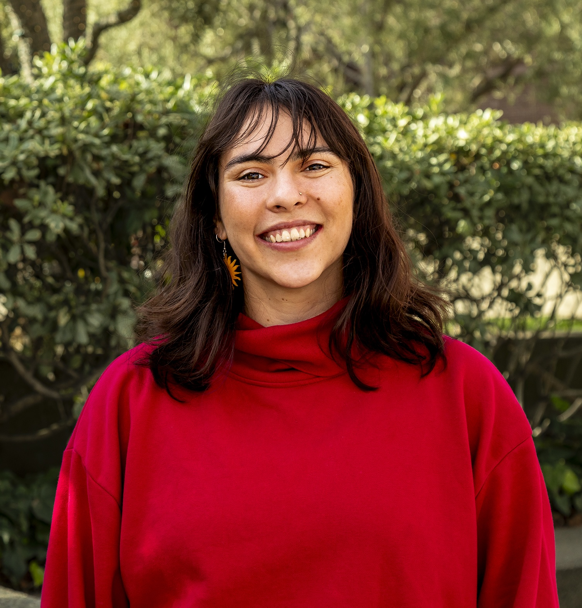

<!-- This hides the title "Research" from this page, since I wanted to have a display title that is different from the page title.  -->

## About Kate

:::: {style="display: flex;"}

::: {}

:::

::: {}

I am a PhD student researcher jointly appointed at the American Museum of Natural History's [Division of Invertebrate Zoology](https://www.amnh.org/research/invertebrate-zoology) and the City University of New York Graduate Center [Department of Biology (Ecology, Evolutionary Biology, and Behavior)](https://www.gc.cuny.edu/biology/subprograms/ecology-evolutionary-biology-and-behavior) where I am advised by Dr. Jessica Ware. I grew up in Folsom, CA, attended UC Berkeley for my undergraduate degree in integrative biology and anthropology, and earned my master's degree in integrative biology jointly at the California Academy of Sciences and San Francisco State University. I see myself as a lifelong learner and want to do all I can to get to know the natural world.

Image credit to Ida Hørup © Exploratorium
